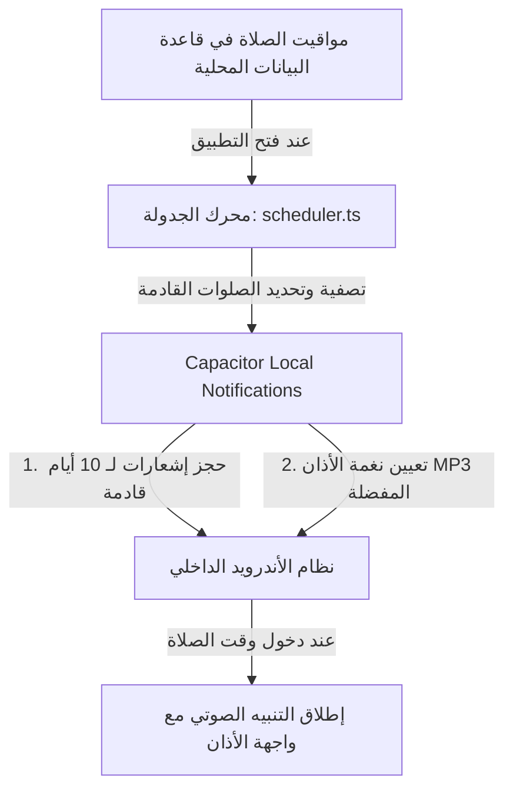

# 🕌 الموسوعة التقنية الشاملة لمشروع "يقين القرآن" | Yaqeen AlQuran

تم إعداد هذا الدليل التقني ليكون المرجع الشامل والأقصى لبنية وهيكلية مشروع **يقين** للقرآن الكريم والمجتمع الإيماني (الإصدار v22). يغطي هذا التحليل بنية الكود سطر بسطر، وتفاصيل خوادم الرندرة، وأنظمة الحماية والتلعيب (Gamification)، وهيكل قاعدة البيانات والربط البرمجي الكامل.

---

## 🧭 الفهرس العام للموسوعة
1. [نظرة عامة والنموذج الهجين (Executive Summary)](#1-نظرة-عامة-والنموذج-الهجين)
2. [البنية المعمارية الكلية ونظام التنقل الفوري (Architecture & Navigation)](#2-البنية-المعمارية-الكلية-ونظام-التنقل-الفوري)
3. [البنية التقنية التفصيلية (Tech Stack & Dependencies)](#3-البنية-التقنية-التفصيلية)
4. [خريطة المجلدات والملفات (Directory Structure & Code Map)](#4-خريطة-المجلدات-والملفات)
5. [تحليل المكونات البرمجية الأساسية (Deep Component Analysis)](#5-تحليل-المكونات-البرمجية-الأساسية)
6. [محرك ومونتاج الفيديو السحابي والمحلي (Video Studio & Remotion Engine)](#6-محرك-ومونتاج-الفيديو-السحابي-والمحلي)
7. [نظام الأذان والتنبيهات غير المتصلة (Adhan & Offline Notifications)](#7-نظام-الأذان-والتنبيهات-غير-المتصلة)
8. [محرك التلعب ونظام النقاط ومكافحة الغش (Gamification & Anti-Cheat)](#8-محرك-التلعب-ونظام-النقاط-ومكافحة-الغش)
9. [الشات بوت الذكي وفلترة المجتمع (AI Chatbot & Moderation Engine)](#9-الشات-بوت-الذكي-وفلترة-المجتمع)
10. [نظام الاشتراكات وبوابة الدفع (Subscription & Billing System)](#10-نظام-الاشتراكات-بوابة-الدفع)
11. [إعدادات البيئة وقواعد الحماية (Environment & Firebase Rules)](#11-إعدادات-البيئة-وقواعد-الحماية)
12. [دليل البناء والنشر المباشر (Deployment & Maintenance Guide)](#12-دليل-البناء-والنشر-المباشر)

---

## 1. نظرة عامة والنموذج الهجين

تطبيق **"يقين"** هو نظام بيئي تقني إسلامي يهدف لدمج الروحانية بالتقنيات الحديثة. يعمل التطبيق كـ **PWA (Progressive Web App)** فائقة السرعة على الويب، ويتحول إلى تطبيق أندرويد أصلي (Native) عبر Capacitor 8.

### الهيكل الهجين (Hybrid Architecture)
يتكون النظام من ثلاثة أجزاء رئيسية تعمل بتكامل تام:
1. **الواجهة الأمامية (SPA Frontend)**: مبنية على Next.js 16 وتعمل على خوادم Vercel لضمان أقصى سرعة تحميل واستجابة.
2. **سيرفر الرندرة (Rendering Engine)**: مخدم منفصل يعمل على Hugging Face Spaces ويسخر موارد خادم Linux مع FFmpeg وSharp لمعالجة الفيديو دون استهلاك موارد متصفح المستخدم أو سيرفر الويب الرئيسي.
3. **خادم الأتمتة (Zernio / Make.com Webhook)**: يستقبل بيانات الفيديو بعد تصييره تلقائياً ويقوم بنشره مباشرة على قنوات ومنصات التواصل الاجتماعي (TikTok & Instagram Reels).

---

## 2. البنية المعمارية الكلية ونظام التنقل الفوري

### نظام الصفحة الواحدة الفوري (SPA Shell)
لتجنب عمليات إعادة التحميل البطيئة وحفاظاً على استقرار تشغيل الصوت في الخلفية، تم تصميم التطبيق بالكامل كـ **Single Page Application (SPA)** تعتمد على مسار Catch-All ديناميكي:
- **الملف الأساسي للمسار**: `src/app/[[...slug]]/page.tsx`
- **مكون التحكم المركزي**: [CatchAllPageClient.tsx](file:///c:/Users/youse/OneDrive/Desktop/New%20folder%20(2)/Quran-main/src/components/CatchAllPageClient.tsx)

### آلية عمل نظام التنقل المخصص (`src/lib/navigation.ts`)
يتجاوز التطبيق نظام التوجيه الافتراضي لـ Next.js ويستخدم أحداثاً مخصصة (Custom Events) لتغيير محتويات الشاشة فورياً:
1. عند الرغبة في الانتقال، يتم استدعاء دالة `navigateTo('/route')`.
2. الدالة تطلق حدثاً مخصصاً باسم `app_navigate` مع تعديل رابط المتصفح عبر `history.pushState` دون إعادة تحميل الصفحة.
3. يستمع المكون الرئيسي [CatchAllPageClient.tsx](file:///c:/Users/youse/OneDrive/Desktop/New%20folder%20(2)/Quran-main/src/components/CatchAllPageClient.tsx) للحدث ويقوم بتغيير الحالة الداخلية للتبويب النشط فوراً بمؤثرات بصرية سلسة.

---

## 3. البنية التقنية التفصيلية

يعتمد التطبيق على ترسانة من التقنيات الحديثة لتقديم واجهة مستخدم ممتازة وأداء مستقر:

| الطبقة التقنية | التقنية المستخدمة | الإصدار | الوظيفة الأساسية |
| :--- | :--- | :--- | :--- |
| **الإطار الرئيسي** | Next.js | 16.2.7 | واجهات المستخدم ومعالجة الـ Client-Side |
| **المكتبة البرمجية** | React | 19.2.4 | بناء الهيكل الشجري وإدارة المكونات |
| **لغة البرمجة** | TypeScript | ^5.0.0 | تأمين الكود وضمان خلوه من أخطاء الأنواع |
| **التصميم والتنسيق** | Tailwind CSS | v4.0.0 | واجهات تفاعلية سريعة متوافقة مع الهواتف |
| **الأنيميشن الحركي** | GSAP & Framer Motion | 3.15.0 | تأثيرات التنقل وحركات المصحف ثلاثية الأبعاد |
| **إدارة قاعدة البيانات** | Firebase Firestore | 12.12.1 | حفظ بيانات المستخدمين، النقاط، والمنشورات |
| **المصادقة والأمان** | Firebase Auth | 12.12.1 | تسجيل الدخول بالبريد وجوجل وOTP |
| **تخزين الملفات** | Firebase Storage | 12.12.1 | استضافة إيصالات الدفع وصور المستخدمين |
| **إخراج الفيديوهات** | Remotion & FFmpeg | 4.0.448 | توليد ورندرة الفيديوهات بمقاس 9:16 |
| **إطار الموبايل الأصلي**| Capacitor | 8.3.1 | تشغيل إشعارات الأذان وتحديد الموقع أوفلاين |
| **معالجة الصور والرسوم**| @napi-rs/canvas & Sharp | ^0.33.5 | تكوين فريمات الفيديو والرسم السيرفري السريع |

---

## 4. خريطة المجلدات والملفات

هيكل المجلدات البرمجية منظم لضمان سهولة الصيانة والتوسيع:

```
Quran-main/
├── public/                      # الصور الثابتة، أصوات الأذان (MP3)، ملفات الخطوط
├── android/                     # مشروع أندرويد الأصلي الخاص بـ Capacitor
├── api/                         # سيرفرات ومخدمات الدعم الخارجية (Node.js)
│   ├── server.js                # API لجلب أوقات الصلاة والقبلة والأنشطة العامة
│   └── chatbot-server.js        # خادم الذكاء الاصطناعي البديل لـ Gemini API
├── src/
│   ├── app/
│   │   ├── [[...slug]]/         # واجهة الـ SPA ومسارات الويب
│   │   └── api/                 # مسارات الـ API الداخلية لـ Next.js
│   │       ├── chat/            # معالجة محادثات الشات بوت
│   │       ├── render/          # واجهة طلب رندرة الفيديوهات
│   │       └── telegram-webhook/# استقبال خلفيات الفيديو من تليجرام تلقائياً
│   ├── components/              # جميع المكونات والواجهات التفاعلية (36 مكوناً)
│   ├── lib/                     # الدوال المساعدة، الحماية، وأنظمة التنبيه
│   │   ├── firebase.ts          # تهيئة اتصال Firebase Client
│   │   ├── firebaseAdmin.ts     # تهيئة Firebase Admin بالصلاحيات الكاملة
│   │   ├── navigation.ts        # نظام التوجيه الفوري داخل التطبيق
│   │   ├── points.ts            # خوارزميات حساب النقاط والرتب
│   │   └── prayerNotifications.ts # جدولة وتدقيق إشعارات الصلاة أوفلاين
│   ├── data/                    # البيانات الثابتة (السور، الأذكار، القراء، الخلفيات)
│   ├── store/                   # مخازن الحالة لـ Zustand (useEditor)
│   └── remotion/                # مكونات ومحركات Remotion لتصميم الفيديو
```

---

## 5. تحليل المكونات البرمجية الأساسية

يحتوي التطبيق على مجموعة من المكونات البرمجية التي تدير المهام الحيوية:

### 5.1 مكون [CatchAllPageClient.tsx](file:///c:/Users/youse/OneDrive/Desktop/New%20folder%20(2)/Quran-main/src/components/CatchAllPageClient.tsx)
- **الوظيفة**: النواة المركزية للتنقل (Shell).
- **المنطق**: يستمع للمتغير `pathname` ويقوم بعمل Switch-Case لعرض المكون المناسب (مثل `MushafChoice`, `DailyHub`, `AudioLibrary`, `Controls`).
- **ميزات إضافية**: يحتوي على هيكل حماية `ErrorBoundary` لعزل أي خطأ يطرأ في شاشات القراءة أو الرندرة لمنع انهيار التطبيق بالكامل.

### 5.2 مكون [AppInitializer.tsx](file:///c:/Users/youse/OneDrive/Desktop/New%20folder%20(2)/Quran-main/src/components/AppInitializer.tsx)
- **الوظيفة**: واجهة التشغيل والتحقق الأولى.
- **المنطق**:
  - يعرض شاشة الترحيب (Splash Screen) بشعار يقين الذهبي مع أنيميشن ناعم.
  - يستمع لحظياً لجدول الإعلانات والتحذيرات الطارئة (`alerts`) في Firestore ليعرضها للمستخدم فور فتح التطبيق.
  - يفحص إصدار التطبيق الحالي لمقارنته بأحدث إصدار وتنبيه المستخدم لتحديث الـ APK.

### 5.3 مكون [AuthGate.tsx](file:///c:/Users/youse/OneDrive/Desktop/New%20folder%20(2)/Quran-main/src/components/AuthGate.tsx)
- **الوظيفة**: بوابة تسجيل الدخول والتسجيل الآمن.
- **المنطق**:
  - يدعم تسجيل الدخول بـ Google وسحب الاسم والصورة مباشرة وحفظها بـ Firestore.
  - يدعم التسجيل العادي بالبريد الإلكتروني ويمنع إنشاء الحساب إلا بعد إرسال رمز OTP عبر البريد والتحقق منه من خلال `/api/verify-otp`.
  - يوفر معرضاً يحتوي على أكثر من 30 صورة رمزية (Avatars) للذكور والإناث مع نظام مولد DiceBear كخيار إضافي.

### 5.4 مكون [DigitalMushaf.tsx](file:///c:/Users/youse/OneDrive/Desktop/New%20folder%20(2)/Quran-main/src/components/DigitalMushaf.tsx)
- **الوظيفة**: المصحف الكامل بالرسم العثماني.
- **المنطق**:
  - يجلب صفحات المصحف من API موقع `Quran.com`.
  - يستخدم `IntersectionObserver` لعمل Infinite Scroll، بحيث يتم تحميل الصفحات التالية ديناميكياً قبل أن يصل المستخدم للقاع لضمان سلاسة تامة في التصفح.
  - يحتوي على درج جانبي تفاعلي (Tafseer Drawer) يعرض تفسير السعدي والتفسير الميسر للآية المحددة بلمسة واحدة.

### 5.5 مكون [AudioLibrary.tsx](file:///c:/Users/youse/OneDrive/Desktop/New%20folder%20(2)/Quran-main/src/components/AudioLibrary.tsx)
- **الوظيفة**: المكتبة الصوتية الشاملة للقرآن.
- **المنطق**:
  - يتيح الاستماع لـ 50+ قارئاً شهيراً.
  - يدعم الحفظ المحلي للمفضلات وسجل السور المستمع إليها مؤخراً.
  - يحتوي على مشغل صوت متطور يدعم التشغيل العشوائي (Shuffle) وتكرار السورة (Repeat) والتحكم التام بالسرعة ومستوى الصوت.

### 5.6 مكون [AdminPanel.tsx](file:///c:/Users/youse/OneDrive/Desktop/New%20folder%20(2)/Quran-main/src/components/AdminPanel.tsx)
- **الوظيفة**: لوحة الإشراف الكاملة للأدمن (أكثر من 2300 سطر).
- **المنطق**:
  - **لوحة تيك توك وإنستجرام**: تتيح للأدمن ربط حساباته وتتبع سجل وجدولة الفيديوهات مع عدادات تقدم الرفع وسرعة النقل.
  - **مراجعة الاشتراكات**: تمكين الأدمن من فحص إيصالات الدفع المرفوعة والموافقة عليها لتفعيل العضوية الممتازة تلقائياً.
  - **إدارة المهام والإشعارات**: إضافة تحديات يومية جديدة وإرسال إشعارات فورية (Push Notifications) لجميع الأجهزة المربوطة.

---

## 6. محرك ومونتاج الفيديو السحابي والمحلي

استوديو صناعة الفيديوهات هو أحد أقوى ميزات منصة يقين، وينقسم لنظامي معالجة:

### 6.1 الرندرة المحلية بالمتصفح (Browser Rendering)
- **الآلية**:
  - يتم استخدام واجهة الـ Canvas 2D لرسم الفريمات بدقة 720×1280.
  - يتم تشغيل آيات السورة بالتتابع مع الصوت وتوليد الموجة الصوتية (Audio Visualizer) لحظياً عبر `AudioContext` ورسمها كأعمدة أو نقاط متفاعلة.
  - يلتقط المتصفح تدفق الفريمات عبر `MediaRecorder` ويقوم بحفظها كملف WebM.
  - **إصلاح مدة الـ WebM**: نظراً لأن ملفات WebM المنتجة بالمتصفح تفتقد لبيانات الطابع الزمني (Duration Metadata) مما يسبب تعطل النشر في تيك توك، تم تطوير دالة ثنائية مخصصة (`ysFixWebmDuration`) تقوم بقراءة الـ Buffer الخاص بالملف وإعادة كتابة ترويسة Ebml وتعيين المدة الزمنية الصحيحة يدوياً على مستوى البايت.

### 6.2 الرندرة السحابية الفائقة (Server-side Rendering)
- **الآلية**: تعمل على سيرفر Hugging Face Spaces باستخدام بيئة Linux مجهزة.
- **الخوارزمية**:
  1. يقوم التطبيق بإرسال طلب رندرة إلى `/api/render` يحتوي على النص، الترجمة، مسار الصوت، ورابط الخلفية.
  2. يقوم السيرفر السحابي بطلب روابط الخلفيات وملفات الصوت ومعالجتها.
  3. يتم استخدام مكتبة `Sharp` البرمجية لدمج وتوليد أسطر الآيات بصيغة SVG فائقة الدقة والوضوح وتحويلها لصور PNG بسرعة تبلغ 60 إطاراً في الثانية.
  4. يستدعي السيرفر برنامج **FFmpeg** لدمج صور الفريمات مع ملف الصوت وتطبيق فلاتر الألوان المطلوبة (مثل Cinematic أو Dramatic) وإخراج الفيديو النهائي بصيغة MP4 خفيفة ومتوافقة 100% مع جميع مشغلات الأجهزة وتيك توك وإنستجرام.

### 6.3 قوالب الرندرة الجاهزة (مثال: قالب المنشاوي)
تم تصميم القالب ليحاكي بطاقة تشغيل كلاسيكية فخمة بأبعاد دقيقة ومدروسة:
- **شريط ألوان الخلفية**: 3 أشرطة أفقية (أسود علوي 380px، رمادي وسطي 520px، وأسود سفلي 380px) بمجموع ارتفاع 1280px.
- **البطاقة المركزية (Card Container)**: تبدأ عند نقطة x=110 و y=410، بعرض 500px وارتفاع 450px مع حواف دائرية rx=40 ولون أسود مظلم.
- **صورة الشيخ**: ممركزة بعرض 450px وارتفاع 185px مع إطار ذهبي رقيق بلون `#8a8070` بطريقة عرض `contain` لضمان عدم قص أي جزء من صورة الشيخ المرتل.

---

## 7. نظام الأذان والتنبيهات غير المتصلة

يعد نظام إشعارات الأذان في يقين من البنى المعقدة حيث يضمن تذكير المستخدم بالصلوات حتى في حال عدم اتصاله بالإنترنت.



### خوارزمية الجدولة الذكية (`prayerNotifications.ts`)
1. **تجنب نفاد طابور النظام**: يتيح نظام أندرويد حجز 64 إشعاراً كحد أقصى لكل تطبيق. يقوم محرك يقين بحجز إشعارات الصلوات الخمس لـ 10 أيام قادمة فقط (50 إشعاراً) بشكل متجدد.
2. **تحديد وقت الأذان بالـ GPS**: يتم جلب إحداثيات خطوط الطول والعرض للمستخدم بدقة عبر Capacitor Geolocation، ثم حساب المواقيت الفلكية الدقيقة بالاعتماد على صيغة الهيئة العامة للمساحة المصرية أو أم القرى.
3. **تنبيه الخلفية الصوتي**: يتم تعيين مسار ملف صوت الأذان (مثل `adhan_makkah.mp3`) كـ `sound` للإشعار المحلي، ليعمل الأذان بصوت كامل ومستمر فور دخول وقت الصلاة حتى لو كان الهاتف مقفلاً.

---

## 8. محرك التلعب ونظام النقاط ومكافحة الغش

التطبيق يدمج نظام Gamification متطور لتحفيز المستخدمين على التلاوة والمواظبة اليومية:

### 8.1 خوارزمية النقاط والحدود اليومية
يتم احتساب النقاط لكل نشاط وتخزينها محلياً وسحابياً في Firestore:

```typescript
// هيكلية توزيع النقاط والحدود اليومية (src/lib/points.ts)
export const POINT_RULES = {
  QURAN_READ: { points: 1, limit: 100 },      // 1 نقطة لكل آية تقرأ (الحد اليومي 100)
  QURAN_LISTEN: { points: 1, limit: 200 },    // 1 نقطة لكل آية تستمع إليها (الحد اليومي 200)
  ATHKAR_READ: { points: 0.5, limit: 200 },   // نصف نقطة لكل ذكر مقروء (الحد اليومي 200)
  SUBHA_COUNT: { points: 0.1, limit: 1000 },  // 0.1 نقطة لكل تسبيحة (الحد اليومي 1000)
  VIDEO_RENDER: { points: 5, limit: 100 },    // 5 نقاط لكل فيديو يصمم (الحد اليومي 100)
};
```

### 8.2 نظام مكافحة التلاعب والغش (Anti-Cheat Engine)
لمنع محاولات النقر السريع التلقائي (Auto-Clickers) أو التلاعب بالنقاط، تم بناء جدار حماية في ملف `src/lib/points.ts`:
- **مقاومة النقر السريع**: يتم تطبيق مؤقت تنازلي (Cooldown) قيمته 150ms in عداد الاستغفار والصلاة على النبي، و200ms في عداد السبحة. أي نقرة تتم خلال هذه الأجزاء من الثانية يتم تجاهلها تماماً ولا تزيد العداد ولا تمنح نقاطاً.
- **تتبع الوقت الفعلي للقراءة**: لمنح نقاط قراءة القرآن، لا يتم الاحتساب بمجرد الانتقال بين الآيات؛ بل يجب أن يقضي المستخدم 1.5 ثانية على الأقل في قراءة الآية الواحدة لتفعيل إضافة النقاط، وذلك باستخدام دوال تتبع المؤقتات (`startAyahTimer` و `endAyahTimer`).

---

## 9. الشات بوت الذكي وفلترة المجتمع

يحتوي التطبيق على شبكة تواصل اجتماعي إيمانية مصغرة ومساعد ذكي للرد على الفتاوى والأسئلة الدينية.

### 9.1 الشات بوت الهجين (Hybrid AI Chatbot)
يعمل الشات بوت الذكي بنظام استجابة ثلاثي الطبقات لضمان السرعة والوفرة:
1. **الطبقة الأولى (المحلي - TF-IDF)**: محرك ذكاء اصطناعي محلي يعمل داخل المتصفح يحلل الرسالة باستخدام خوارزمية Cosine Similarity ومقارنتها بقاعدة بيانات الأسئلة الشائعة للرد الفوري في أقل من 1ms دون استدعاء أي خادم.
2. **الطبقة الثانية (Gemini 2.0 Flash)**: في حال عدم مطابقة السؤال محلياً، يتم توجيه الاستعلام لخادم Gemini 2.0 Flash السريع عبر API مخصص للحصول على رد فقهي مفصل وموثق بالآيات والأحاديث.
3. **الطبقة الثالثة (Llama 3.3 70B via Groq)**: بديل فائق السرعة يتم استدعاؤه تلقائياً في أجزاء من الثانية في حال تعطل أو وصول خوادم Gemini للحد الأقصى للاستخدام.

### 9.2 نظام تصفية النصوص الرقابي الذكي (Moderation Engine)
تم بناء محرك فلترة متطور لمنع الألفاظ البذيئة أو الإعلانات غير اللائقة في المنشورات والتعليقات، ويعمل وفق الخطوات التالية:
1. **توحيد التشكيل وحذف الحركات**: إزالة كافة حركات التشكيل والتنوين والمدّ لتفادي كتابة الكلمة البذيئة بحركات مختلفة لتجاوز الفلتر.
2. **تنظيف الحروف وتوحيدها**: دمج الرموز والفواصل وحذف النقاط المفرقة (مثل تحويل `أ، إ، آ` إلى `ا` و `ة` إلى `هـ`) لكشف الكلمات الأصلية.
3. **تقليص التكرار**: تحويل الحروف الممدودة والمكررة للحد الأدنى (مثال: تحويل `حمااااار` إلى `حمار`).
4. **التصنيف والتوجيه الآلي**:
   - **الكلمات البذيئة الصريحة (Hard Block)**: يرفض النظام نشرها كلياً وتظهر رسالة تحذيرية حمراء للمستخدم.
   - **الكلمات المشكوك فيها (Soft Block)**: يتم قبول النشر برمجياً ولكن يضاف للمنشور وسم `isBlocked: true` ليظهر لصاحبه فقط كونه `قيد المراجعة` بينما يختفي تماماً عن بقية مستخدمي التطبيق ويذهب تلقائياً للوحة المشرفين للمراجعة والبت فيه.

---

## 10. نظام الاشتراكات وبوابة الدفع

يتحكم التطبيق بصلاحيات صناعة الفيديوهات السحابية من خلال باقات اشتراك مرنة:

### 10.1 خطط الاشتراكات والترقية
- **الخطة المجانية**: تتيح للمستخدم رندرة 5 فيديوهات شهرياً وتظهر علامة مائية عشوائية على الفيديوهات المنتجة.
- **خطة Starter**: تتيح رندرة 50 فيديو شهرياً دون علامة مائية.
- **خطة Premium**: رندرة غير محدودة وبجودة فائقة تصل إلى 4K.
- **الترقية التلقائية بالنقاط (Gamified Auto-Upgrade)**: تقديراً لتفاعل المستخدمين، بمجرد وصول نقاط المستخدم في لوحة الصدارة إلى **10,000 نقطة**، يقوم النظام تلقائياً بترقية حسابه إلى خطة Premium مجاناً مدى الحياة.

### 10.2 بوابة رفع إيصالات الدفع الآمنة
لتسريع وتأمين المعاملات المالية (عبر فودافون كاش أو إنستاباي)، تم بناء نظام إثبات الدفع المباشر:
- يقوم المستخدم برفع صورة إيصال التحويل البنكي أو لقطة الشاشة مباشرة من واجهة التطبيق.
- يتم رفع الصورة إلى **Firebase Storage** في مجلد `receipts/{userId}` لضمان استقرار وسرية المستندات.
- يتم إدراج طلب الاشتراك في Firestore بحالة `pending_verification` مع تسجيل رقم الهاتف والمبلغ المحول ورابط الإيصال المرفوع.
- تظهر لوحة المشرفين تنبيهاً فورياً للأدمن لمراجعة البيانات والموافقة بلمسة واحدة لتفعيل العضوية الممتازة للمستخدم.

---

## 11. إعدادات البيئة وقواعد الحماية

تعتمد بنية الحماية والأمان للتطبيق على إعدادات بيئية مشفرة وقواعد صارمة للوصول لبيانات Firestore:

### 11.1 قواعد أمان Firestore (Firestore Security Rules)
تمت كتابة قواعد الأمان بدقة لمنع تزوير النقاط أو اختراق بيانات المستخدمين:
- **مجلد المستخدمين `users/{uid}`**: لا يُسمح بالقراءة إلا للمستخدم المسجل دخوله، ويُحظر تماماً التعديل أو الكتابة على الحقول إلا للمستخدم نفسه بشرط مطابقة الـ `uid` الخاص بجلسة المصادقة مع الـ `uid` للمستند المستهدف.
- **لوحة المتصدرين والمنشورات**: القراءة متاحة للجميع لتمكين زوار الموقع من رؤية المحتوى والترتيب الإيماني، بينما الكتابة والتعديل محصورة بالأعضاء المسجلين والتحقق الكامل من خلو النصوص من المحتوى المحظور.

### 11.2 المتغيرات البيئية الحساسة (`.env.local`)
تخزن المتغيرات الأمنية بعيداً عن كود الواجهة الأمامية للحفاظ على سريتها:
- `FIREBASE_SERVICE_ACCOUNT_KEY`: المفتاح السري المعتمد لـ Firebase Admin للعمليات ذات الصلاحيات الكاملة.
- `SMTP_USER` & `SMTP_PASS`: بيانات اتصال خوادم البريد الإلكتروني لإرسال رموز OTP للتحقق.
- `GEMINI_API_KEY` & `PEXELS_API_KEY`: مفاتيح الوصول لبوابات الذكاء الاصطناعي ومكتبات الصور الخلفية.

---

## 12. دليل البناء والنشر المباشر

### 12.1 أوامر التشغيل الأساسية (Next.js)
```bash
# تثبيت كافة المكتبات والاعتماديات
npm install

# تشغيل خادم التطوير المحلي
npm run dev

# بناء نسخة الويب النهائية المتوافقة مع محركات البحث ومكثفة الأداء
npm run build:next
```

### 12.2 أوامر تشغيل وبناء تطبيق أندرويد (Capacitor)
لتحديث تطبيق الأندرويد الأصلي وتصدير ملف APK النهائي:
```bash
# بناء الكود المصدري وتحديث مجلد الـ Android في Capacitor
npm run build && npx cap sync android

# تشغيل بيئة بناء الأندرويد محلياً وتوليد ملف APK النهائي
npm run final-build
```

### 12.3 النشر على الخوادم (Deployment)
- **الويب (SPA Frontend)**: يتم النشر تلقائياً بمجرد عمل `git push` لفرع `main` حيث يستمع خادم **Vercel** للتحركات ويقوم بالبناء التلقائي ورفع التحديث على رابط الموقع الرسمي (`yaqeenalquran.online`).
- **خادم الرندر (Hugging Face Server)**: يُبنى عبر Dockerfile المرفق ويُرفع كـ Space على Hugging Face ليقوم بمعالجة المهام الثقيلة والرندرة بشكل مستقر ومنفصل.

---
*تم صياغة وإعداد هذه الموسوعة التقنية الشاملة لتوثيق كافة تفاصيل تطبيق وموقع يقين v22*
*بواسطة: يوسف أسامة & Antigravity AI*
