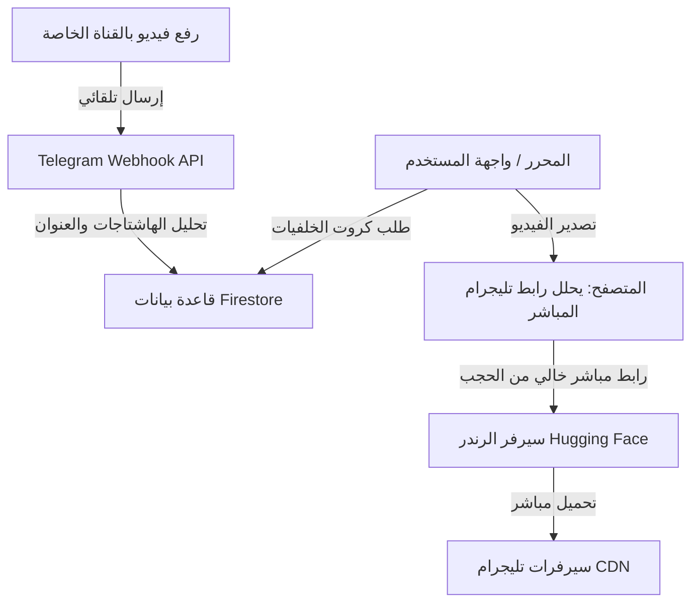

# دليل تشغيل وبرمجة نظام "يقين" لخلفيات الفيديو السحابية عبر تليجرام

يوثق هذا المستند بنية النظام الذكي المبتكر لتخزين واستدعاء خلفيات الفيديو الصامتة باستخدام قنوات وتليجرام بوت كمخزن سحابي مجاني وغير محدود، والتحديات التقنية التي تم حلها بالكامل أثناء التطوير.

---

## 🗺️ بنية ومعمارية النظام (System Architecture)

يعتمد النظام على 4 أركان رئيسية للتخزين والاستدعاء التلقائي:



---

## 🛠️ المشاكل التقنية التي تم حلها (Challenges & Solutions)

### 1. خطأ تجميع المعلمات في Next.js 16 (Next.js Async Params)
*   **المشكلة**: Next.js 15+ و 16 يعاملون معلمات المسارات الديناميكية (`params`) كـ `Promise`. كتابة `const { fileId } = params` تسببت في جعل المعرف غير معرف (`undefined`) مما أرجع خطأ `{"error":"Missing fileId"}`.
*   **الحل**: تعديل دالة الاستقبال لتنتظر المعلمات أولاً:
    ```typescript
    const { fileId } = await params;
    ```

### 2. التوجيه الدائم والشرطة المائلة في تليجرام (trailingSlash 308 Redirect)
*   **المشكلة**: إعدادات Next.js تحتوي على `trailingSlash: true`. عند مناداة البوت لرابط الويب هوك `/api/telegram-webhook` كان السيرفر يرد بـ `308 Permanent Redirect` لإضافة الشرطة المائلة في النهاية (`/api/telegram-webhook/`). تليجرام لا يتبع هذا التوجيه ففشل الاستقبال التلقائي بـ (Error 500/308).
*   **الحل**: تسجيل رابط الويب هوك في تليجرام بالشرطة المائلة مباشرة:
    ```text
    https://yaqeenalquran.online/api/telegram-webhook/
    ```

### 3. حظر جدار حماية Vercel لسيرفر الرندر (Vercel Firewall & AWS IPs)
*   **المشكلة**: عند تصدير الفيديو، كان سيرفر الرندر (Hugging Face) يحاول تحميل الخلفية من `/api/background/[fileId].mp4`. جدار حماية Vercel يقوم بحجب خوادم Hugging Face (لأن آي بي الخوادم مشبوه كـ Bot/Scraper) مما سبب فشل التحميل بـ `fetch failed`.
*   **الحل**:
    1. تمكين الـ API من إرجاع رابط تليجرام المباشر عند تمرير المعامل `?json=true`.
    2. تعديل كود المتصفح ليقوم بطلب الرابط المباشر أولاً من موقعه، ثم يمرر رابط تليجرام الأصلي والموثوق (`https://api.telegram.org/file/bot...`) لسيرفر الرندر ليقوم بالتحميل المباشر من تليجرام دون المرور بـ Vercel.

### 4. صلاحيات Firestore ومفتاح الأدمن التالف
*   **المشكلة**: قواعد الحماية لـ Firestore كانت تمنع كتابة الخلفيات بدون صلاحية الأدمن، ولم يكن البوت يستطيع الكتابة لعدم تطابق مفتاح الـ Firebase Admin SDK (بسبب حرف زائد `n` وتداخل سطور المفتاح أثناء التخزين).
*   **الحل**:
    1. تصحيح المفتاح المشفر في `src/lib/firebaseAdmin.ts` واختباره برمجياً ليعمل بنجاح.
    2. إضافة قواعد سماح صريحة لمجموعة `backgrounds` ليكون القراءة عامة للجميع والكتابة مقصورة على الأدمن فقط.

---

## 💾 الأكواد البرمجية المعتمدة (Source Code Reference)

### 1. الـ API الرئيسي لحل روابط الفيديوهات والكاش:
**المسار**: `src/app/api/background/[fileId]/route.ts`

```typescript
import { NextResponse } from "next/server";

interface CacheEntry {
  url: string;
  expiresAt: number;
}
const urlCache = new Map<string, CacheEntry>();
const CACHE_DURATION_MS = 50 * 60 * 1000;

export async function GET(
  request: Request,
  { params }: { params: Promise<{ fileId: string }> }
) {
  try {
    const { fileId } = await params;
    if (!fileId) return NextResponse.json({ error: "Missing fileId" }, { status: 400 });

    const { searchParams } = new URL(request.url);
    const returnJson = searchParams.get("json") === "true";
    const cleanFileId = fileId.replace(/\.mp4$/, "");

    const token = process.env.TELEGRAM_BOT_TOKEN;
    if (!token) return NextResponse.json({ error: "Server configuration error" }, { status: 500 });

    const now = Date.now();
    const cached = urlCache.get(cleanFileId);

    if (cached && cached.expiresAt > now) {
      if (returnJson) return NextResponse.json({ url: cached.url });
      return NextResponse.redirect(cached.url, 307);
    }

    const getFileUrl = `https://api.telegram.org/bot${token}/getFile?file_id=${cleanFileId}`;
    const fileRes = await fetch(getFileUrl, { next: { revalidate: 0 } });
    
    if (!fileRes.ok) return NextResponse.json({ error: "Failed to get file" }, { status: fileRes.status });

    const fileData = await fileRes.json();
    if (!fileData.ok || !fileData.result?.file_path) {
      return NextResponse.json({ error: "Invalid file data" }, { status: 400 });
    }

    const filePath = fileData.result.file_path;
    const directDownloadUrl = `https://api.telegram.org/file/bot${token}/${filePath}`;

    urlCache.set(cleanFileId, { url: directDownloadUrl, expiresAt: now + CACHE_DURATION_MS });

    if (returnJson) return NextResponse.json({ url: directDownloadUrl });
    return NextResponse.redirect(directDownloadUrl, 307);
  } catch (error: any) {
    return NextResponse.json({ error: "Internal server error" }, { status: 500 });
  }
}
```

### 2. الـ Webhook الخاص بالاستقبال التلقائي من القناة:
**المسار**: `src/app/api/telegram-webhook/route.ts`

```typescript
import { NextResponse } from "next/server";
import { getAdminApp } from "@/lib/firebaseAdmin";
import admin from "firebase-admin";

const EXPECTED_CHANNEL_ID = -1004363174660; 
const ALLOWED_CATEGORIES = ["مساجد", "بحار", "جبال", "غابات", "الثلج", "غروب", "سماء", "طبيعة"];

export async function POST(request: Request) {
  try {
    const body = await request.json();
    const post = body.channel_post || body.edited_channel_post;
    if (!post) return NextResponse.json({ success: true, message: "No post found" });

    const chatId = post.chat?.id;
    if (chatId !== EXPECTED_CHANNEL_ID) return NextResponse.json({ success: true });

    const video = post.video;
    if (!video || !video.file_id) return NextResponse.json({ success: true });

    const fileId = video.file_id;
    const caption = post.caption || "";
    
    const tags: string[] = [];
    const hashtagRegex = /#(\S+)/g;
    let match;
    while ((match = hashtagRegex.exec(caption)) !== null) {
      tags.push(match[1]);
    }

    let title = caption.replace(hashtagRegex, "").trim();
    if (!title) title = `فيديو سحابي ${new Date().toLocaleDateString("ar-EG")}`;

    let category = "طبيعة";
    for (const tag of tags) {
      if (ALLOWED_CATEGORIES.includes(tag)) {
        category = tag;
        break;
      }
    }

    if (!tags.includes(category)) tags.push(category);
    if (!tags.includes("فيديو")) tags.push("فيديو");

    const adminDb = admin.firestore(getAdminApp());
    const backgroundsCol = adminDb.collection("backgrounds");
    const querySnap = await backgroundsCol.where("fileId", "==", fileId).limit(1).get();

    const itemData = {
      title,
      type: "video",
      src: `/api/background/${fileId}.mp4`,
      fileId,
      category,
      tags,
      updatedAt: admin.firestore.FieldValue.serverTimestamp(),
    };

    if (!querySnap.empty) {
      await querySnap.docs[0].ref.update(itemData);
      return NextResponse.json({ success: true, action: "updated" });
    } else {
      await backgroundsCol.add({ ...itemData, createdAt: admin.firestore.FieldValue.serverTimestamp() });
      return NextResponse.json({ success: true, action: "added" });
    }
  } catch (error: any) {
    return NextResponse.json({ success: false, error: error.message }, { status: 500 });
  }
}
```

---

## 🚀 كيفية تشغيل وفحص النظام السحابي

### 1. إعداد الويب هوك (مرة واحدة فقط)
يتم تسجيل الرابط بالشرطة المائلة في النهاية لضمان الاستجابة الصحيحة بدون إعادة توجيه:
```text
https://api.telegram.org/bot<TELEGRAM_BOT_TOKEN>/setWebhook?url=https://yaqeenalquran.online/api/telegram-webhook/
```

### 2. رفع الفيديو وتلقي التفاصيل تلقائياً
1. ارفع الفيديو بصيغة `.mp4` في القناة.
2. اكتب تفاصيل الفيديو في الوصف (مثال):
   `غروب الشمس على النيل #غروب #طبيعة`
3. ستقوم الخلفية بالظهور في الموقع خلال 3 ثوانٍ تحت قسم **غروب** وتاغات **[غروب, طبيعة, فيديو]**.
