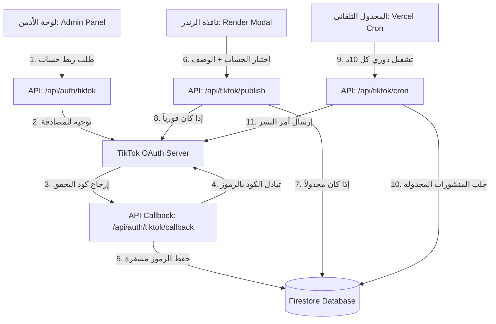

# دليل تكامل ونظام النشر التلقائي على TikTok | TikTok Integration Guide

دليل توثيقي شامل يشرح البنية التحتية، تدفق البيانات، والملفات البرمجية التي تم إنشاؤها وتعديلها لبناء نظام ربط تيك توك وجدولة الفيديوهات في منصة **يقين**.

---

## 🗺️ البنية العامة للنظام (Architecture)

يعتمد النظام على بروتوكول **OAuth 2.0** للربط الآمن، ومحرك **TikTok Content Posting API** لرفع الفيديوهات، ومجدول **Vercel Cron** للجدولة التلقائية.



---

## 📂 هيكلة قاعدة البيانات (Firestore Schema)

تم إنشاء مجموعتين رئيسيتين لإدارة الحسابات والمنشورات:

### 1. مجموعة الحسابات المربوطة (`/tiktok_accounts`)
تخزن بيانات التعريف وجلسات الربط لكل حساب تيك توك:
* `id` (Document ID): معرف منشئ المحتوى الفريد من تيك توك.
* `username`: اسم الحساب (على سبيل المثال: `@yqeen_app`).
* `displayName`: الاسم الظاهر للحساب.
* `avatar`: صورة الملف الشخصي.
* `accessToken`: رمز الوصول الموثق للعمليات الحالية.
* `refreshToken`: رمز تجديد الصلاحية (صالح لمدة سنة).
* `expiresAt`: تاريخ انتهاء رمز الوصول الحالي (يتم تجديده تلقائياً).
* `refreshTokenExpiresAt`: تاريخ انتهاء رمز التجديد.
* `addedBy`: معرف الأدمن الذي ربط الحساب.

### 2. مجموعة سجل وجدولة المنشورات (`/tiktok_logs`)
تدير طابور النشر الفوري والمجدول:
* `id` (Document ID): توليد تلقائي.
* `videoUrl`: رابط ملف الفيديو المخرج (MP4).
* `accountId`: معرف حساب تيك توك المستهدف.
* `caption`: نص المنشور (العنوان والهاشتاجات).
* `status`: حالة النشر الحالية (`pending` مجدول، `uploading` جاري الرفع، `completed` تم النشر، `failed` فشل النشر).
* `publishId`: معرف المهمة المستلم من تيك توك لمتابعة المعالجة.
* `scheduledFor`: تاريخ ووقت النشر المجدول (يكون `null` إذا كان النشر فورياً).
* `publishedAt`: التاريخ الفعلي للنشر.
* `error`: رسالة الخطأ في حال فشل النشر.

---

## 🛠️ الملفات البرمجية التي تم تطويرها

### 1. مسارات خادم الويب (Backend API Routes)

*   **[route.ts (Auth Init)](file:///c:/Users/youse/OneDrive/Desktop/New%20folder%20%282%29/Quran-main/src/app/api/auth/tiktok/route.ts)**:
    يستقبل طلب الأدمن، ويتحقق من هوية الأدمن وصلاحية جلسته عبر Firebase ID token الممرر في المتغير `token` لمنع أي هجوم CSRF، ثم يوجه المتصفح لصفحة تسجيل الدخول والموافقة في تيك توك.
*   **[route.ts (Callback)](file:///c:/Users/youse/OneDrive/Desktop/New%20folder%20%282%29/Quran-main/src/app/api/auth/tiktok/callback/route.ts)**:
    يستقبل الرد من تيك توك بعد نجاح المصادقة، يتبادل الكود برموز الوصول والتجديد، يستعلم عن بيانات الحساب من تيك توك، ثم يحفظها بقاعدة البيانات ويغلق نافذة المنبثقة تلقائياً مع تنبيه واجهة الأدمن للتحديث.
*   **[route.ts (Publish)](file:///c:/Users/youse/OneDrive/Desktop/New%20folder%20%282%29/Quran-main/src/app/api/tiktok/publish/route.ts)**:
    يتحقق من جلسة الأدمن أولاً. يقوم بتحديث رمز الوصول تلقائياً إذا كان منتهي الصلاحية قبل الاستخدام. ثم يطلق أمر النشر المباشر أو يضيف الفيديو لطابور الجدولة الزمني.
*   **[route.ts (Cron)](file:///c:/Users/youse/OneDrive/Desktop/New%20folder%20%282%29/Quran-main/src/app/api/tiktok/cron/route.ts)**:
    مسار يعمل بشكل دوري ومجدول عبر الـ Cron. يستعلم عن الفيديوهات المجدولة الحالية والماضية التي لم تُنشر بعد، ثم يستدعي سيرفر تيك توك لنشرها وتحديث حالتها بقاعدة البيانات تلقائياً.

### 2. تعديل الواجهات الرسومية (UI Integration)

*   **[AdminPanel.tsx](file:///c:/Users/youse/OneDrive/Desktop/New%20folder%20%282%29/Quran-main/src/components/AdminPanel.tsx)**:
    * إضافة التبويب الحصري للأدمن **إدارة تيك توك 📱** في القائمة الجانبية.
    * **شريط تقدم رفع الفيديو (Upload Progress):** أثناء رفع الفيديو، يعرض الجدول شريط تقدم متفاعل رسومياً (مثال: `█████████░░░░ 72%`) مع حساب وسرعة الرفع الحقيقية (MB/s).
    * **لوحة تحكم إحصائيات التفاعل (Analytics Dashboard):** لوحة تلخيصية في أعلى الصفحة تعرض إجمالي المشاهدات 👀، الإعجابات ❤️، التعليقات 💬، المشاركات 🔗، والتفضيلات ⭐ لجميع الفيديوهات المنشورة.
    * **زر إعادة المحاولة (Retry Publish):** في حال فشل النشر (مثل انتهاء صلاحية الجلسة أو خطأ في الرفع)، يظهر كارت الخطأ موضحاً السبب مع زر "إعادة المحاولة" لإعادة إرسال طلب النشر على نفس السجل.
    * جدول لعرض سجل وجدولة المنشورات مع حالات النشر التفصيلية.
*   **[RenderModal.tsx](file:///c:/Users/youse/OneDrive/Desktop/New%20folder%20%282%29/Quran-main/src/components/RenderModal.tsx)**:
    * بمجرد انتهاء المونتاج بنجاح، يُظهر للأدمن قسماً كاملاً لإعداد منشور تيك توك.
    * **توليد الوصف التلقائي:** يتم استخلاص اسم القارئ الحالي واسم السورة لبناء عنوان وهاشتاجات جذابة تلقائياً (مثل: `#سورة_الملك #الشيخ_ياسر_الدوسري`).
    * **غلاف تيك توك التلقائي (TikTok Cover Generator):** يحدد النظام تلقائياً نقطة غلاف الفيديو عند الثانية 1.5 (`video_cover_timestamp_ms: 1500`) لتفادي عرض أول إطار أسود كصورة غلاف للفيديو.
    * تفعيل خيار الجدولة مع إظهار حقل لتحديد التاريخ والوقت بدقة.

### 3. أدوات التحقق والاختبار
*   **[test_tiktok_api.js](file:///c:/Users/youse/OneDrive/Desktop/New%20folder%20%282%29/Quran-main/scratch/test_tiktok_api.js)**:
    سكربت اختبار للتأكد من سلامة ربط وإمكانية كتابة وقراءة سجلات تيك توك بقواعد البيانات.

---

## 🔒 متطلبات التشغيل والبيئة (Environment Setup)

لبدء تفعيل النظام، يجب إضافة المتغيرات البيئية التالية في لوحة تحكم سيرفرك (مثال: Vercel):

```env
# مفاتيح تطبيق تيك توك للمطورين
TIKTOK_CLIENT_KEY=your_tiktok_client_key_here
TIKTOK_CLIENT_SECRET=your_tiktok_client_secret_here

# سر حماية رابط المجدول التلقائي (اختياري)
CRON_SECRET=your_cron_execution_secret
```
