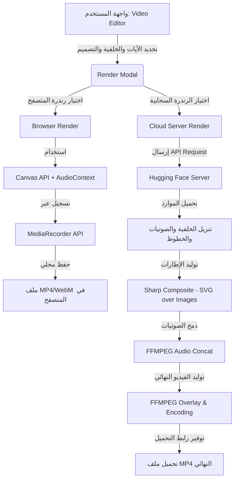

# دليل رندرة الفيديو في تطبيق يقين | Video Rendering Guide

يحتوي تطبيق يقين على نظام متطور لإنشاء وتصدير الفيديوهات الإسلامية بمقاسات عمودية (9:16) مناسبة لمنصات التواصل الاجتماعي (TikTok, Instagram Reels, YouTube Shorts). يعتمد التطبيق على طريقتين للرندرة: **الرندرة المحلية بالمتصفح (Browser Rendering)** و**الرندرة السحابية الفائقة (Server Rendering)**.

---

## 🗺️ المخطط العام لنظام الرندرة



---

## 1️⃣ الرندرة المحلية عبر المتصفح (Browser Render)

تتم هذه العملية بالكامل داخل جهاز المستخدم دون إرسال أي بيانات أو ملفات لخادم خارجي.

*   **المكون المسؤول في الكود**: [RenderModal.tsx](file:///c:/Users/youse/OneDrive/Desktop/New%20folder%20%282%29/Quran-main/src/components/RenderModal.tsx) داخل الدالة `handleBrowserRender`.
*   **التقنيات المستخدمة**:
    *   `HTMLCanvasElement.captureStream(30)`: لالتقاط حركة الـ Canvas بمعدل 30 إطارًا في الثانية.
    *   `AudioContext` و `createMediaStreamDestination()`: لدمج مسارات الصوت الخاصة بتلاوة الآيات وإرسالها إلى مجرى التسجيل.
    *   `MediaRecorder`: لتسجيل مجرى الفيديو والصوت المدمجين وترميزهما إلى ملف فيديو.

### ⚙️ آلية العمل:
1. يتم تحميل صورة الخلفية أو تشغيل فيديو الخلفية بشكل خفي في خلفية الكود.
2. يتم تشغيل ملفات صوت الآيات تلو الأخرى بشكل متزامن.
3. مع كل إطار يرسم الكود النص القرآني، التشكيل، الترجمة، ورقم الآية، بالإضافة إلى تحديث حركة المؤثرات البصرية (Visualizer) المتفاعلة مع ترددات الصوت عبر `AudioContext.AnalyserNode`.
4. يقوم الـ `MediaRecorder` بالتقاط ما يُرسم على الـ Canvas مع دمج الصوت حتى انتهاء التلاوة وتوليد ملف الفيديو بصيغة `MP4` أو `WebM`.

*   **المميزات**: مجانية بالكامل، لا تستهلك خوادم، سريعة على الأجهزة ذات المواصفات العالية.
*   **العيوب**: تعتمد على أداء جهاز المستخدم؛ أي بطء في الجهاز قد يؤدي إلى تقطيع أو عدم تزامن الصوت مع الصورة في الفيديو النهائي.

---

## 2️⃣ الرندرة السحابية الفائقة (Server Render / Hyper Render v22)

نظام رندرة خارجي متطور ومحسن لأقصى سرعة ممكنة يعتمد على مزج الإطارات في الذاكرة دون الحاجة لمتصفح وهمي (Zero Chromium Memory Leak).

*   **المكون المسؤول في الواجهة**: [RenderModal.tsx](file:///c:/Users/youse/OneDrive/Desktop/New%20folder%20%282%29/Quran-main/src/components/RenderModal.tsx) داخل الدالة `handleServerRender`.
*   **خادم الرندرة**: [render.mjs](file:///c:/Users/youse/OneDrive/Desktop/New%20folder%20%282%29/Quran-main/render.mjs) مبني بـ Node.js و Express ومستضاف على منصة Hugging Face.

### ⚙️ آلية العمل بالتفصيل:

#### 1. استقبال الطلب وتحليل الموارد
* يرسل التطبيق طلب `POST` إلى `/render` يحتوي على:
  * بيانات الآيات (النصوص، التلاوات الصوتية).
  * إعدادات التصميم (نوع الخط وحجمه، الفلاتر، التأثيرات الحركية).
  * مسار الخلفية (صورة أو فيديو) وحسابات التواصل الاجتماعي (`instaHandle`, `tiktokHandle`).
* يقوم الخادم بتوليد معرف فريد للمهمة (`jobId`) ويرجع الاستجابة الفورية للمستخدم لمتابعة التقدم.

#### 2. تحميل الملفات والخطوط
* يقوم الخادم بتنزيل وحفظ الخطوط المطلوبة (مثل `Amiri` أو `Cairo`) وتخزينها مؤقتاً في الذاكرة المؤقتة للخادم.
* تنزيل فيديو/صورة الخلفية وحفظه في مجلد مؤقت باسم `bg.mp4` أو `bg.jpg`.
* تنزيل ملفات الصوت الخاصة بالآيات وحساب طولها بالثواني بدقة متناهية باستخدام أداة `ffprobe`.

#### 3. توليد الإطارات (Sharp Composite Engine)
* بدلاً من استخدام متصفح ثقيل مثل Chromium لأخذ لقطات شاشة (Screenshots)، يقوم المحرك بكتابة أكواد `SVG` برمجية تمثل النصوص القرآنية المنسقة، التراجم، الإطارات، الزخارف، والعلامات المائية للمستخدمين.
* تدعم الرندرة ميزتين هامتين:
  * **تأثيرات الدخول (Transitions)**: مثل `fade` و `slideUp` و `zoomIn` بحساب قيم التعتيم (opacity) والإزاحة الإطارية تدريجياً.
  * **تتبع الكلمات النشطة (Karaoke Tracking)**: تلوين الكلمة الجاري تلاوتها باللون الذهبي عبر تفكيك أسطر الآية وتحديد الكلمة النشطة زمنياً.
* تُحول نصوص الـ `SVG` إلى `Buffer` وتُدمج فوق صورة الخلفية مباشرة باستخدام مكتبة `sharp` لإنتاج إطارات صور متتالية بجودة عالية وسرعة فائقة.

#### 4. تجميع الصوت والفيديو النهائي (FFMPEG Engine)
* **دمج الصوت**: يتم دمج ملفات الصوت لكل آية باستخدام فلتر `concat` في FFMPEG مع عمل إعادة تشكيل للترددات (Resampling) لمنع حدوث فرقعات أو انقطاع في الصوت.
* **دمج الإطارات**: يكتب الخادم ملف `frames.txt` يحدد فيه مسار كل إطار وصورته والمدة الزمنية لعرضه بدقة متناهية لتتطابق تماماً مع تلاوة القارئ.
* **البناء النهائي**:
  * **إذا كانت الخلفية صورة**: يُدمج الصوت مع الإطارات مباشرة بترميز `libx264` ومستوى ضغط سريع `ultrafast`.
  * **إذا كانت الخلفية فيديو**: يقوم FFMPEG بقص فيديو الخلفية تلقائياً ليناسب النسبة الطولية 9:16 ويكرره بـ `-stream_loop -1` ثم يضع الإطارات الشفافة فوقه كـ `overlay` بالتزامن مع الصوت المدمج.
* بعد اكتمال الفيديو يُنقل لمجلد التنزيلات المتاح للعامة ويقوم الخادم بتحديث حالة الطلب إلى `completed` وإرسال رابط تنزيل الفيديو المباشر للمستخدم.

*   **المميزات**: جودة خارقة، استقرار تام وثابت للتزامن الحركي والسمعي، لا يتأثر بمواصفات جهاز العميل، وسرعة رندرة رهيبة.
*   **العيوب**: استهلاك الموارد وحزم البيانات على الخادم السحابي.

---

## 🛠️ كيف تبدأ تشغيل خادم الرندرة محلياً؟

لتشغيل خادم الرندرة السحابي بشكل مستقل على جهازك الشخصي:

1. تأكد من تثبيت أدوات **FFmpeg** و **FFprobe** وإضافتهما لمتغيرات البيئة (Environment Variables) في نظام تشغيلك.
2. قم بتثبيت الاعتماديات المطلوبة:
   ```bash
   npm install express cors sharp dotenv
   ```
3. شغل الخادم مباشرة عبر Node.js:
   ```bash
   node render.mjs
   ```
4. سيعمل الخادم على المنفذ `7860`. لتوجيه التطبيق لاستخدام جهازك بدلاً من Hugging Face، قم بتغيير رابط الاستدعاء في ملف [RenderModal.tsx](file:///c:/Users/youse/OneDrive/Desktop/New%20folder%20%282%29/Quran-main/src/components/RenderModal.tsx) إلى `http://localhost:7860`.
