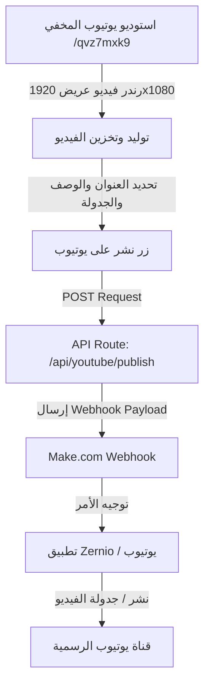

# 📋 نظام استوديو ونشر يوتيوب (YouTube Wide Studio) — التوثيق الشامل

**المشروع:** يقين القرآن — Yaqeen Al-Quran  
**الموقع الرسمي:** [https://yaqeenalquran.online](https://yaqeenalquran.online)  
**تاريخ التوثيق:** 06 سبتمبر 2026  

---

## 📑 الفهرس
1. [الروابط الهامة والصفحة السرية](#1-الروابط-الهامة-والصفحة-السرية)
2. [المفاتيح والبيانات السرية (Credentials)](#2-المفاتيح-والبيانات-السرية-credentials)
3. [كيفية عمل النظام (System Architecture)](#3-كيفية-عمل-النظام-system-architecture)
4. [الملفات البرمجية التي تم إنشاؤها وتعديلها](#4-الملفات-البرمجية-التي-تم-إنشاؤها-وتعديلها)
5. [متغيرات البيئة المطلوبة (Environment Variables)](#5-متغيرات-البيئة-المطلوبة-environment-variables)
6. [إعدادات Make.com و Zernio](#6-إعدادات-makecom-و-zernio)
7. [خطوات النشر والتجربة](#7-خطوات-النشر-والتجربة)

---

## 1. الروابط الهامة والصفحة السرية

| الصفحة / الخدمة | الرابط | الوصف |
| :--- | :--- | :--- |
| **استوديو يوتيوب المخفي (Wide Studio)** | `https://yaqeenalquran.online/qvz7mxk9` | الصفحة السرية غير المدرجة بالقوائم لتوليد ونشر فيديوهات 16:9 |
| **لوحة الإدارة العامة (Admin)** | `https://yaqeenalquran.online/admin` | إدارة الخلفيات والمحتوى العام |
| **الموقع الرئيسي** | `https://yaqeenalquran.online` | واجهة المستخدم العامة |
| **رابط Webhook (Make.com)** | `https://hook.eu1.make.com/tl01y7q4wfa8k1rzg1lvggvb93yolmf4` | الرابط البرمجي لاستقبال أوامر النشر إلى Zernio/يوتيوب |

---

## 2. المفاتيح والبيانات السرية (Credentials)

* **Zernio API Key:**
  ```text
  sk_e79e01e86d0f0499e55b0e768b9287c194d4b5c4843ee49040220efc21186a42
  ```
* **YouTube Account ID (Zernio Connection):**
  ```text
  6a9cfafb77555aae01e37454
  ```
* **Make.com Webhook URL:**
  ```text
  https://hook.eu1.make.com/tl01y7q4wfa8k1rzg1lvggvb93yolmf4
  ```

---

## 3. كيفية عمل النظام (System Architecture)



1. **الرندر:** يقوم استوديو `/qvz7mxk9` بمعالجة الآيات القرآنية والتلاوة، وتوليد فيديو عريض بأبعاد **1920×1080 (أفقي 16:9)**.
2. **التجهيز:** بعد انتهاء الرندر، يظهر رابط التحميل ومربع النشر المباشر على يوتيوب (العنوان، الوصف، الكلمات المفتاحية، وتاريخ الجدولة الاختياري).
3. **الطلب البرمجي:** بمجرد الضغط على "نشر على يوتيوب"، يتم استدعاء `/api/youtube/publish`.
4. **التكامل مع Make & Zernio:** يقوم الـ API بإرسال حمولة البيانات (Payload) متضمنة:
   * رابط الفيديو المباشر (`videoUrl`)
   * العنوان والوصف والهاشتاجات (`title`, `description`, `tags`)
   * معرّف الحساب في Zernio (`accountId = 6a9cfafb77555aae01e37454`)
   * تاريخ الجدولة إن وجد بصيغة ISO (`scheduledFor`)
   * نوع المنصة (`platform = "youtube"`)

---

## 4. الملفات البرمجية التي تم إنشاؤها وتعديلها

### 1. صفحة الاستوديو العريض السري:
* **المسار:** `src/app/qvz7mxk9/page.tsx`
* **المميزات:**
  * صفحة مخصصة ومخفية تماماً من محركات البحث والـ sitemap.
  * واجهة داكنة مريحة مصممة لإنتاج فيديوهات اليوتيوب 16:9.
  * دعم كامل لمعاينة الفيديو بعد الرندر.
  * نموذج متكامل لإدخال تفاصيل النشر والجدولة الزمنية.

### 2. نقطة نهاية الـ API للنشر:
* **المسار:** `src/app/api/youtube/publish/route.ts`
* **المميزات:**
  * يستقبل طلب النشر ويتحقق من الروابط والبيانات.
  * يرسل البيانات إلى Make.com عبر الـ Webhook.
  * تم ضبط الـ Fallback التلقائي إلى الـ Webhook الخاص بك حتى لو لم يُمرر عبر الـ Environment Variables:
    ```typescript
    const makeWebhookUrl =
      process.env.MAKE_YOUTUBE_WEBHOOK_URL ||
      process.env.MAKE_WEBHOOK_URL ||
      "https://hook.eu1.make.com/tl01y7q4wfa8k1rzg1lvggvb93yolmf4";
    ```
  * يدعم النشر المباشر عبر Zernio API كخيار إضافي في حال توفر الـ Direct Integration.

---

## 5. متغيرات البيئة المطلوبة (Environment Variables)

في لوحة استضافة الموقع (مثل Vercel أو الخادم الخاص بك)، تأكد من وجود المتغيرات الآتية:

```env
MAKE_YOUTUBE_WEBHOOK_URL=https://hook.eu1.make.com/tl01y7q4wfa8k1rzg1lvggvb93yolmf4
ZERNIO_API_KEY=sk_e79e01e86d0f0499e55b0e768b9287c194d4b5c4843ee49040220efc21186a42
NEXT_PUBLIC_BASE_URL=https://yaqeenalquran.online
```

---

## 6. إعدادات Make.com و Zernio

* **حساب يوتيوب المربوط في Zernio:**  
  `6a9cfafb77555aae01e37454`
* **تنسيق التاريخ والوقت للجدولة:**
  * التنسيق المعتمد: `YYYY-MM-DDTHH:mm:ss.sssZ`
  * التوقيت: `Africa/Cairo`
* **ملاحظة سيناريو Make.com المشترك:**
  * بما أن الـ Webhook مستخدم لكل من TikTok ويوتيوب، في حال أردت فصل النشر (نشر يوتيوب فقط دون تيك توك والعكس)، يمكنك إضافة **Router** في سيناريو Make.com ووضع شرط Filter على حقل `platform`:
    * المسار الأول: إذا كان `platform = "youtube"` يوجه إلى موديول Zernio YouTube.
    * المسار الثاني: إذا كان `platform = "tiktok"` يوجه إلى موديول Zernio TikTok.

---

## 7. خطوات النشر والتجربة

1. ادخل إلى: [https://yaqeenalquran.online/qvz7mxk9](https://yaqeenalquran.online/qvz7mxk9)
2. اختر السورة، القارئ، ومجال الآيات المطلوب.
3. اضغط على **"بدء الرندر"**.
4. بعد اكتمال التوليد، اكتب العنوان والوصف المناسب.
5. (اختياري) فعّل خيار الجدولة واختر الموعد.
6. اضغط على **"نشر على يوتيوب"** لمتابعة الحالة وتأكيد وصول البيانات بنجاح إلى قناتك.
