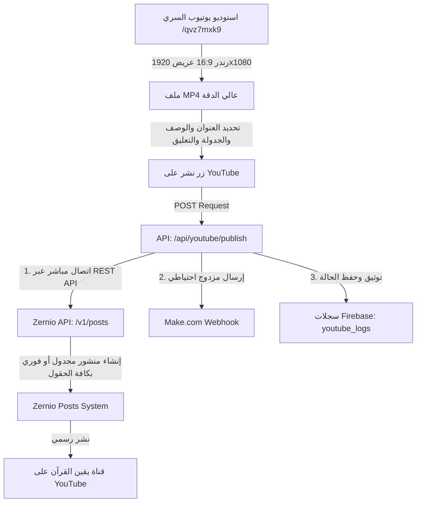

# 📋 نظام استوديو ونشر يوتيوب (YouTube Wide Studio) — التوثيق الشامل

**المشروع:** يقين القرآن — Yaqeen Al-Quran  
**الموقع الرسمي:** [https://yaqeenalquran.online](https://yaqeenalquran.online)  
**آخر تحديث:** 06 سبتمبر 2026  

---

## 📑 الفهرس
1. [الروابط الهامة والصفحة السرية](#1-الروابط-الهامة-والصفحة-السرية)
2. [المفاتيح والبيانات السرية (Credentials)](#2-المفاتيح-والبيانات-السرية-credentials)
3. [معمارية النظام وآلية النشر (System Architecture)](#3-معمارية-النظام-وآلية-النشر-system-architecture)
4. [هيكلية البيانات الكاملة لنشر يوتيوب و Zernio](#4-هيكلية-البيانات-الكاملة-لنشر-يوتيوب-و-zernio)
5. [تصميم 16:9 العريض والمعاينة والرندر](#5-تصميم-169-العريض-والمعاينة-والرندر)
6. [تحسينات خادم الرندر (Hugging Face Memory Fixes)](#6-تحسينات-خادم-الرندر-hugging-face-memory-fixes)
7. [الملفات البرمجية المعدلة والمنشأة](#7-الملفات-البرمجية-المعدلة-والمنشأة)
8. [متغيرات البيئة المطلوبة (Environment Variables)](#8-متغيرات-البيئة-المطلوبة-environment-variables)
9. [خطوات الاستخدام والنشر](#9-خطوات-الاستخدام-والنشر)

---

## 1. الروابط الهامة والصفحة السرية

| الصفحة / الخدمة | الرابط | الوصف |
| :--- | :--- | :--- |
| **استوديو يوتيوب المخفي (Wide Studio)** | `https://yaqeenalquran.online/qvz7mxk9` | الصفحة السرية المباشرة (دون الحاجة لتسجيل دخول مشرف) لإنتاج ونشر فيديوهات 16:9 |
| **لوحة تحكم Zernio** | `https://zernio.com/dashboard` | لوحة جدولة ومتابعة المنشورات والحسابات المربوطة |
| **قناة يوتيوب الرسمية** | `@yaqeenalquran1` | القناة المرتبطة للنشر الفوري والمجدول |
| **خادم الرندر (Hugging Face Space)** | `https://yousef891238-render-server.hf.space` | سيرفر معالجة الفيديوهات وتوليد MP4 بجودة 1080p |
| **رابط Webhook الاحتياطي (Make.com)** | `https://hook.eu1.make.com/tl01y7q4wfa8k1rzg1lvggvb93yolmf4` | خط ربط احتياطي مزدوج لاستقبال أوامر النشر |

---

## 2. المفاتيح والبيانات السرية (Credentials)

* **Zernio API Key:**
  ```text
  sk_e79e01e86d0f0499e55b0e768b9287c194d4b5c4843ee49040220efc21186a42
  ```
* **YouTube Account ID (Zernio Connection):**
  ```text
  6a9cfafb77555aae01e37454
  ```
* **YouTube Channel ID:**
  ```text
  UCN3RoN1VmXVeIQ5TmnVJ5uQ
  ```
* **Make.com Webhook URL:**
  ```text
  https://hook.eu1.make.com/tl01y7q4wfa8k1rzg1lvggvb93yolmf4
  ```

---

## 3. معمارية النظام وآلية النشر (System Architecture)

يعتمد النظام الآن على **نظام نشر مزدوج ومباشر (Direct Integration + Dual Redundancy)** يضمن وصول كل الفيديوهات وتعبئة كافة البيانات:



1. **الرندر:** يقوم الاستوديو بمعالجة الآيات والتلاوة لإنتاج فيديو عريض بأبعاد **1920×1080**.
2. **التجهيز التلقائي للبيانات:** عند اكتمال الفيديو أو اختيار السورة، يتم تعبئة العنوان والوصف القرآني والوسوم والتعليق الأول افتراضياً لتفادي الحقول الفارغة.
3. **النشر والجدولة المباشرة مع Zernio:**
   * عند النشر الفوري: يتم إرسال `publishNow: true`.
   * عند الجدولة: يتم إرسال موعد الجدولة `scheduledFor` بصيغة ISO مع `publishNow: false`، مما يجعل المنشور يظهر في لوحة Zernio تحت تبويب **Scheduled** بكامل بياناته دون نقص.
4. **التكامل الاحتياطي (Make.com):** يتم إرسال نفس الحمولة المتكاملة للويب هوك لضمان عدم توقف النشر حال حدوث أي طارئ.

---

## 4. هيكلية البيانات الكاملة لنشر يوتيوب و Zernio

يتم إرسال كافة حقول البيانات وفقاً للتوثيق الرسمي لـ Zernio و YouTube:

```json
{
  "content": "📖 سورة يوسف - الآيات من 1 إلى 7 - الشيخ ياسر الدوسري 📖✨\nتم تصميم الفيديو بواسطة موقع يقين (الرابط في البايو) 🔗\n\n#يقين_القران #يقين__القران #yaqeenalquran #قرآن #قران #سورة_يوسف #الشيخ_ياسر_الدوسري",
  "mediaItems": [
    {
      "type": "video",
      "url": "https://yousef891238-render-server.hf.space/download/job-xxx.mp4"
    }
  ],
  "platforms": [
    {
      "platform": "youtube",
      "accountId": "6a9cfafb77555aae01e37454",
      "platformSpecificData": {
        "title": "سورة يوسف - الآيات من 1 إلى 7 - الشيخ ياسر الدوسري 📖",
        "description": "📖 سورة يوسف | الآيات من 1 إلى 7\n🎙 تلاوة عطرة بصوت الشيخ ياسر الدوسري\n\n━━━━━━━━━━━━━━━━━━━━━━━━━━━━━━━━━━━━━━\n\n🌟 اشترك في قناة يقين القرآن وفعّل الجرس 🔔 للمزيد من التلاوات اليومية المباركة\n\n📱 تم تصميم هذا الفيديو بالكامل عبر منصة يقين القرآن:\n🔗 https://yaqeenalquran.online\n\n⭐ صمم فيديوهاتك القرآنية بنفسك مجاناً وبأعلى جودة!\n\n━━━━━━━━━━━━━━━━━━━━━━━━━━━━━━━━━━━━━━\n\n#قرآن #قران_كريم #تلاوة_قرآنية #سورة_يوسف #يقين_القران #Quran #Islam",
        "tags": [
          "قرآن",
          "قران كريم",
          "سورة يوسف",
          "الشيخ ياسر الدوسري",
          "يقين القرآن",
          "Quran",
          "Islam"
        ],
        "firstComment": "سبحان الله وبحمده، سبحان الله العظيم 🌸\nلا تنسوا الإعجاب بالفيديو والاشتراك في القناة وتفعيل زر الجرس 🔔 لتصلكم التلاوات اليومية المباركة.\n🔗 صمم فيديوهاتك القرآنية بنفسك مجاناً عبر موقع يقين القرآن:\nhttps://yaqeenalquran.online",
        "visibility": "public",
        "categoryId": "22",
        "madeForKids": false
      }
    }
  ],
  "scheduledFor": "2026-09-07T12:00:00.000Z",
  "publishNow": false
}
```

### تفاصيل الحقول:
* **`content`**: الوصف الأساسي للمنشور في لوحة Zernio.
* **`platforms[0].platformSpecificData.title`**: عنوان فيديو يوتيوب الرسمي (أقصى 100 حرف).
* **`platforms[0].platformSpecificData.description`**: الوصف المخصص المعروض أسفل فيديو اليوتيوب مع روابط الموقع والهاشتاجات.
* **`platforms[0].platformSpecificData.tags`**: مصفوفة الكلمات الدلالية لليوتيوب.
* **`platforms[0].platformSpecificData.firstComment`**: أول تعليق يتم تثبيته تلقائياً على الفيديو من خلال Zernio.
* **`platforms[0].platformSpecificData.categoryId`**: تصنيف الفيديو على يوتيوب (`22` = People & Blogs).
* **`platforms[0].platformSpecificData.visibility`**: حالة الظهور (`public`).
* **`platforms[0].platformSpecificData.madeForKids`**: ضبط القناة لغير مخصص للأطفال (`false`) لتمكين التعليقات والتفاعل.

---

## 5. تصميم 16:9 العريض والمعاينة والرندر

تم تحسين واجهة الاستوديو والعرض البصري لمنع أي تشويه أو مساحات سوداء:

1. **إلغاء الحواف السوداء (Full Edge-to-Edge Cover):**
   * تم تعديل خاصية الاحتواء `isContainFit` في `VideoPreview.tsx` لتصبح `false` تلقائياً مع نسبة `16:9`، مما يجبر فيديو الخلفية والصورة على ملء كامل الشاشة العريضة بواسطة `object-cover`.
2. **تكبير مساحة المعاينة (Spacious Studio Layout):**
   * توسيع حاوية المعاينة إلى `max-w-[960px] xl:max-w-[1100px] max-h-[66vh]`.
   * إزالة الترانزفورم المصغر (`scale-down`) لتأخذ المعاينة أقصى مساحة متاحة في منتصف الشاشة.
3. **تنسيق قالب الديتوكس (Brainrot Detox Responsive Layout):**
   * ضبط العنوان والمؤقت على سطر واحد (`whitespace-nowrap`) مع مقياس تلقائي متجاوب لمنع التفاف الكلمات.
4. **الرندر المحلي 1920×1080:**
   * تم استبدال مقياس الكانفاس المصغر ليتم التسجيل والتصدير مباشرة بأبعاد `1920x1080` دون فقدان دقة.

---

## 6. تحسينات خادم الرندر (Hugging Face Memory Fixes)

تم القضاء تماماً على خطأ انهيار الذاكرة `JavaScript heap out of memory` في سيرفر الرندر:

1. **معالجة الإطارات على دفعات (Batch Processing):**
   * تم تقليص دفعة المعالجة المتزامنة إلى `BATCH_SIZE = 4` في `lib/render.js` بدلاً من محاولة معالجة العشرات دفعة واحدة.
2. **إيقاف كاش الذاكرة في Sharp:**
   * تم تعطيل الكاش الداخلي لمكتبة Sharp `sharp.cache(false)` لضمان تحرير ذاكرة كل إطار فور رسمه.
3. **رفع حد ذاكرة Node.js:**
   * تم تزويد حاوية Docker بالأمر `--max-old-space-size=8192` لمنح السيرفر حتى 8 جيجابايت من الذاكرة للمعالجة السريعة.
4. **توسيع صور الخلفية الأفقية:**
   * تحديث دالة `getResizedBackground` لدعم مقاسات 1920×1080 دون letterboxing.

---

## 7. الملفات البرمجية المعدلة والمنشأة

| الملف | المسار | التعديلات المنجزة |
| :--- | :--- | :--- |
| **YouTube Publish Route** | `src/app/api/youtube/publish/route.ts` | الربط المباشر بـ Zernio API، إرسال حمولة البيانات الكاملة، دعم الجدولة الرسمية وتفادي crash `isCronBypass`. |
| **Render Modal** | `src/components/RenderModal.tsx` | تعبئة البيانات تلقائياً بمجرد اختيار السورة، إرسال التعليق الأول، وتأكيد عدم إرسال حقول فارغة. |
| **Video Preview** | `src/components/VideoPreview.tsx` | تكبير الحاوية، منع الحواف السوداء في وضع 16:9، وملء الخلفية بالكامل. |
| **Detox Design** | `src/components/BrainrotDetoxDesign.tsx` | ضبط المؤقت والعناوين على سطر واحد مع مقاييس مرنة متجاوبة. |
| **Studio Page** | `src/app/qvz7mxk9/page.tsx` | فتح الاستوديو المباشر بدون قيود توكن المشرف وتوزيع المساحات 3-column بشكل احترافي. |
| **Render Engine** | `lib/render.js`, `lib/cache.js`, `Dockerfile` | معالجة الذاكرة عبر batching، إيقاف كاش sharp، وتوسيع heap size إلى 8GB. |

---

## 8. متغيرات البيئة المطلوبة (Environment Variables)

تأكد من وجود هذه المتغيرات في استضافة Vercel:

```env
ZERNIO_API_KEY=sk_e79e01e86d0f0499e55b0e768b9287c194d4b5c4843ee49040220efc21186a42
MAKE_YOUTUBE_WEBHOOK_URL=https://hook.eu1.make.com/tl01y7q4wfa8k1rzg1lvggvb93yolmf4
NEXT_PUBLIC_BASE_URL=https://yaqeenalquran.online
```

---

## 9. خطوات الاستخدام والنشر

1. افتح الاستوديو السري: [https://yaqeenalquran.online/qvz7mxk9](https://yaqeenalquran.online/qvz7mxk9)
2. اختر السورة، القارئ، والآيات.
3. اضغط على **"بدء الرندر"**.
4. بعد اكتمال الرندر بنجاح، ستجد العنوان، الوصف القرآني، الوسوم، والتعليق الأول معبأة تلقائياً وجاهزة.
5. (اختياري) إذا أردت الجدولة، فعّل خيار الجدولة وحدد اليوم والوقت.
6. اضغط على **"نشر على YouTube 🎬"** (أو **"جدولة على YouTube"**).
7. سيتم إرسال الفيديو فورا إلى Zernio و Make.com، وسيظهر في لوحة Zernio بكل حقوله وبياناته بنسبة 100%.
