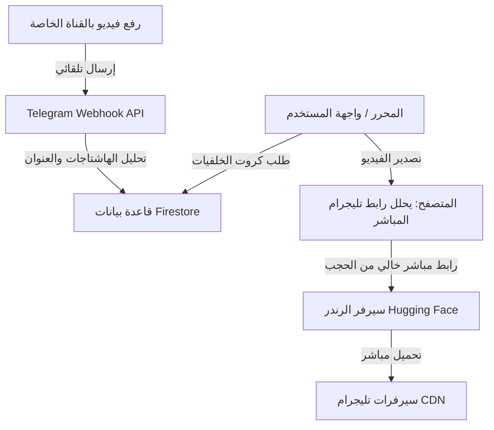

# دليل تشغيل وبرمجة نظام "يقين" لخلفيات الفيديو السحابية عبر تليجرام

يوثق هذا المستند بنية النظام الذكي المبتكر لتخزين واستدعاء خلفيات الفيديو الصامتة باستخدام قنوات وتليجرام بوت كمخزن سحابي مجاني وغير محدود، والتحديات التقنية التي تم حلها بالكامل أثناء التطوير.

---

## 🗺️ بنية ومعمارية النظام (System Architecture)

يعتمد النظام على 4 أركان رئيسية للتخزين والاستدعاء التلقائي:



---

## 🛠️ المشاكل التقنية التي تم حلها (Challenges & Solutions)

### 1. خطأ تجميع المعلمات في Next.js 16 (Next.js Async Params)
*   **المشكلة**: Next.js 15+ و 16 يعاملون معلمات المسارات الديناميكية (`params`) كـ `Promise`. كتابة `const { fileId } = params` تسببت في جعل المعرف غير معرف (`undefined`) مما أرجع خطأ `{"error":"Missing fileId"}`.
*   **الحل**: تعديل دالة الاستقبال لتنتظر المعلمات أولاً:
    ```typescript
    const { fileId } = await params;
    ```

### 2. التوجيه الدائم والشرطة المائلة في تليجرام (trailingSlash 308 Redirect)
*   **المشكلة**: إعدادات Next.js تحتوي على `trailingSlash: true`. عند مناداة البوت لرابط الويب هوك `/api/telegram-webhook` كان السيرفر يرد بـ `308 Permanent Redirect` لإضافة الشرطة المائلة في النهاية (`/api/telegram-webhook/`). تليجرام لا يتبع هذا التوجيه ففشل الاستقبال التلقائي بـ (Error 500/308).
*   **الحل**: تسجيل رابط الويب هوك في تليجرام بالشرطة المائلة مباشرة:
    ```text
    https://yaqeenalquran.online/api/telegram-webhook/
    ```

### 3. حظر جدار حماية Vercel لسيرفر الرندر (Vercel Firewall & AWS IPs)
*   **المشكلة**: عند تصدير الفيديو، كان بث محتوى الفيديو عبر Vercel يستهلك باقة النقل السحابي (Fast Origin Transfer) بسرعة خيالية تخطت سقف الـ 10GB شهرياً.
*   **الحل الجذري المعتمد**:
    1. تحويل مسار `/api/background/[fileId]` ليعمل كـ **تحويل فوري مباشر (302 Redirect)** إلى رابط تليجرام CDN المشفر، مما قلص حجم الاستجابة من 30MB إلى 200 بايت فقط، مانعاً استهلاك باندويث Vercel تماماً!
    2. دعم معامل `?json=true` لإرجاع رابط التحميل المباشر للخدمات البرمجية وسيرفر الرندر.

### 4. صلاحيات Firestore ومفتاح الأدمن التالف
*   **المشكلة**: قواعد الحماية لـ Firestore كانت تمنع كتابة الخلفيات بدون صلاحية الأدمن، ولم يكن البوت يستطيع الكتابة لعدم تطابق مفتاح الـ Firebase Admin SDK (بسبب حرف زائد `n` وتداخل سطور المفتاح أثناء التخزين).
*   **الحل**:
    1. تصحيح المفتاح المشفر في `src/lib/firebaseAdmin.ts` واختباره برمجياً ليعمل بنجاح.
    2. إضافة قواعد سماح صريحة لمجموعة `backgrounds` ليكون القراءة عامة للجميع والكتابة مقصورة على الأدمن فقط.

---

## 💾 الأكواد البرمجية المعتمدة (Source Code Reference)

### 1. الـ API الرئيسي لبث محتوى الفيديوهات والكاش:
**المسار**: `src/app/api/background/[fileId]/route.ts`

```typescript
import { NextResponse } from "next/server";

interface CacheEntry {
  url: string;
  expiresAt: number;
}
const urlCache = new Map<string, CacheEntry>();
const CACHE_DURATION_MS = 50 * 60 * 1000;

export async function GET(
  request: Request,
  { params }: { params: Promise<{ fileId: string }> }
) {
  try {
    const { fileId } = await params;
    if (!fileId) return NextResponse.json({ error: "Missing fileId" }, { status: 400 });

    const { searchParams } = new URL(request.url);
    const returnJson = searchParams.get("json") === "true";
    const cleanFileId = fileId.replace(/\.mp4$/, "");

    const token = process.env.TELEGRAM_BOT_TOKEN;
    if (!token) return NextResponse.json({ error: "Server configuration error" }, { status: 500 });

    const now = Date.now();
    const cached = urlCache.get(cleanFileId);

    let directDownloadUrl = "";

    if (cached && cached.expiresAt > now) {
      directDownloadUrl = cached.url;
    } else {
      const getFileUrl = `https://api.telegram.org/bot${token}/getFile?file_id=${cleanFileId}`;
      const fileRes = await fetch(getFileUrl, { next: { revalidate: 0 } });
      
      if (!fileRes.ok) return NextResponse.json({ error: "Failed to get file" }, { status: fileRes.status });

      const fileData = await fileRes.json();
      if (!fileData.ok || !fileData.result?.file_path) {
        return NextResponse.json({ error: "Invalid file data" }, { status: 400 });
      }

      const filePath = fileData.result.file_path;
      directDownloadUrl = `https://api.telegram.org/file/bot${token}/${filePath}`;

      urlCache.set(cleanFileId, { url: directDownloadUrl, expiresAt: now + CACHE_DURATION_MS });
    }

    if (returnJson) return NextResponse.json({ url: directDownloadUrl });

    // تحويل مباشر (302 Redirect) إلى رابط تليجرام لمنع استهلاك باندويث Vercel بالكامل
    return NextResponse.redirect(directDownloadUrl, {
      status: 302,
      headers: {
        "Cache-Control": "public, max-age=3600",
        "Access-Control-Allow-Origin": "*",
      },
    });
  } catch (error: any) {
    return NextResponse.json({ error: "Internal server error" }, { status: 500 });
  }
}
```

### 5. إزالة الحاجة للهاشتاجات نهائياً ودعم استخراج الأقسام بالذكاء الدلالي
*   **المشكلة**: كان النظام يشترط كتابة علامات الهاشتاج `#` في وصف الفيديو ليتم التعرف على القسم والتاغات. إذا رُفع الفيديو بدون `#` أو بدون كابشن كان يذهب دائماً للقسم الافتراضي دون تصنيف دقيق، كما كانت تُلغى الفيديوهات المرسلة كملفات (Document).
*   **الحل**:
    1. إضافة قاموس دلالي ذكي لمطابقة الكلمات الطبيعية (مثل: بحر، شاطئ، أمواج -> بحار | مسجد، كعبة، حرم -> مساجد | قمم، جبل -> جبال).
    2. تنظيف العناوين وإزالة أي رموز `#` تلقائياً من العناوين والتاغات.
    3. دعم استقبال مقاطع الفيديو المرسلة كملفات `document` (MIME: `video/*`) بجانب `video` العادي.

---

## 💾 الأكواد البرمجية المعتمدة (Source Code Reference)

### 1. الـ API الرئيسي لبث محتوى الفيديوهات والكاش:
**المسار**: `src/app/api/background/[fileId]/route.ts`

```typescript
import { NextResponse } from "next/server";

interface CacheEntry {
  url: string;
  expiresAt: number;
}
const urlCache = new Map<string, CacheEntry>();
const CACHE_DURATION_MS = 50 * 60 * 1000;

export async function GET(
  request: Request,
  { params }: { params: Promise<{ fileId: string }> }
) {
  try {
    const { fileId } = await params;
    if (!fileId) return NextResponse.json({ error: "Missing fileId" }, { status: 400 });

    const { searchParams } = new URL(request.url);
    const returnJson = searchParams.get("json") === "true";
    const cleanFileId = fileId.replace(/\.mp4$/, "");

    const token = process.env.TELEGRAM_BOT_TOKEN;
    if (!token) return NextResponse.json({ error: "Server configuration error" }, { status: 500 });

    const now = Date.now();
    const cached = urlCache.get(cleanFileId);

    let directDownloadUrl = "";

    if (cached && cached.expiresAt > now) {
      directDownloadUrl = cached.url;
    } else {
      const getFileUrl = `https://api.telegram.org/bot${token}/getFile?file_id=${cleanFileId}`;
      const fileRes = await fetch(getFileUrl, { next: { revalidate: 0 } });
      
      if (!fileRes.ok) return NextResponse.json({ error: "Failed to get file" }, { status: fileRes.status });

      const fileData = await fileRes.json();
      if (!fileData.ok || !fileData.result?.file_path) {
        return NextResponse.json({ error: "Invalid file data" }, { status: 400 });
      }

      const filePath = fileData.result.file_path;
      directDownloadUrl = `https://api.telegram.org/file/bot${token}/${filePath}`;

      urlCache.set(cleanFileId, { url: directDownloadUrl, expiresAt: now + CACHE_DURATION_MS });
    }

    if (returnJson) return NextResponse.json({ url: directDownloadUrl });

    // البث المباشر للمحتوى (Stream Proxy)
    const videoRes = await fetch(directDownloadUrl);
    if (!videoRes.ok) return NextResponse.json({ error: "Failed to stream video" }, { status: videoRes.status });

    return new Response(videoRes.body, {
      headers: {
        "Content-Type": videoRes.headers.get("content-type") || "video/mp4",
        "Content-Length": videoRes.headers.get("content-length") || "",
        "Cache-Control": "public, max-age=31536000, immutable",
      },
    });
  } catch (error: any) {
    return NextResponse.json({ error: "Internal server error" }, { status: 500 });
  }
}
```

### 2. الـ Webhook الخاص بالاستقبال التلقائي من القناة:
**المسار**: `src/app/api/telegram-webhook/route.ts`

```typescript
import { NextResponse } from "next/server";
import { getAdminApp } from "@/lib/firebaseAdmin";
import admin from "firebase-admin";

const EXPECTED_CHANNEL_ID = -1004363174660; 

export async function POST(request: Request) {
  try {
    const body = await request.json();
    const post = body.channel_post || body.edited_channel_post;
    if (!post) return NextResponse.json({ success: true, message: "No post found" });

    const chatId = post.chat?.id;
    if (chatId !== EXPECTED_CHANNEL_ID) return NextResponse.json({ success: true });

    // دعم الفيديو العادي أو المرفوع كملف
    const video = post.video || (post.document && post.document.mime_type?.startsWith("video/") ? post.document : null);
    if (!video || !video.file_id) return NextResponse.json({ success: true });

    const fileId = video.file_id;
    const caption = post.caption || "";
    
    // قاموس الكلمات الدلالية لكل تصنيف للتعرف التلقائي بدون أي هاشتاج
    const CATEGORY_KEYWORDS: Record<string, string[]> = {
      "مساجد": ["مسجد", "مساجد", "مكة", "كعبة", "المدينة", "الحرم", "حرم", "اذان", "أذان", "صلاة", "اسلام", "إسلام", "islamic", "mosque", "mecca", "kaaba", "quran", "قرآن", "جامع"],
      "بحار": ["بحر", "بحار", "شاطئ", "شواطئ", "محيط", "محيطات", "أمواج", "موج", "ماء", "مياه", "نهر", "أنهار", "شلال", "شلالات", "sea", "ocean", "beach", "waves", "water", "lake", "بحيرة"],
      "جبال": ["جبل", "جبال", "قمة", "قمم", "صخر", "صخور", "هضاب", "تلال", "mountain", "mountains", "rocks", "hills"],
      "غابات": ["غابة", "غابات", "شجر", "أشجار", "أخضر", "خضار", "حديقة", "حدائق", "نبات", "نباتات", "ورود", "زهور", "forest", "trees", "nature", "green", "jungle"],
      "الثلج": ["ثلج", "ثلوج", "جليد", "شتاء", "صقيع", "برد", "snow", "ice", "winter", "cold", "frost"],
      "غروب": ["غروب", "شروق", "مغيب", "شمس", "أصيل", "شفق", "صباح", "sunset", "sunrise", "sun", "dawn", "dusk"],
      "سماء": ["سماء", "سحب", "سحاب", "غيم", "غيوم", "مطر", "أمطار", "نجوم", "قمر", "فضاء", "ليل", "sky", "clouds", "rain", "stars", "moon", "night"],
      "طبيعة": ["طبيعة", "طبيعي", "مناظر", "landscape", "nature"],
    };

    const normalizeArabic = (text: string) => {
      return text
        .toLowerCase()
        .replace(/#/g, "")
        .replace(/[أإآ]/g, "ا")
        .replace(/ة/g, "ه")
        .replace(/ى/g, "ي")
        .replace(/[ًٌٍَُِّْ]/g, "")
        .trim();
    };

    const normalizedCaption = normalizeArabic(caption);

    // تحديد القسم المناسب من كلمات النص تلقائياً بدون الحاجة لأي هاشتاج
    let category = "طبيعة";
    for (const [catName, keywords] of Object.entries(CATEGORY_KEYWORDS)) {
      if (keywords.some((kw) => normalizedCaption.includes(normalizeArabic(kw)))) {
        category = catName;
        break;
      }
    }

    // استخراج العنوان وتنظيفه نهائياً من أي علامات هاشتاج
    let title = caption
      .replace(/#/g, "")
      .replace(/\s+/g, " ")
      .trim();

    if (!title) {
      title = `فيديو سحابي ${new Date().toLocaleDateString("ar-EG")}`;
    }

    // إنشاء الكلمات الدلالية كتاغات صافية بدون أي هاشتاجات
    const tags: string[] = [category, "فيديو"];

    const cleanWords = caption
      .replace(/[#،,.\-_:;!؟?()\[\]{}"'\\/]/g, " ")
      .split(/\s+/)
      .map((w) => w.trim())
      .filter((w) => w.length > 2 && !["هذا", "هذه", "التي", "الذي", "على", "إلى", "الى", "منه", "معها", "في", "من", "عن", "مع"].includes(w));

    for (const word of cleanWords) {
      if (!tags.includes(word)) {
        tags.push(word);
      }
    }

    const adminDb = admin.firestore(getAdminApp());
    const backgroundsCol = adminDb.collection("backgrounds");
    const querySnap = await backgroundsCol.where("fileId", "==", fileId).limit(1).get();

    const itemData = {
      title,
      type: "video",
      src: `/api/background/${fileId}.mp4`,
      fileId,
      category,
      tags,
      updatedAt: admin.firestore.FieldValue.serverTimestamp(),
    };

    if (!querySnap.empty) {
      await querySnap.docs[0].ref.update(itemData);
      return NextResponse.json({ success: true, action: "updated" });
    } else {
      await backgroundsCol.add({ ...itemData, fit: "cover", createdAt: admin.firestore.FieldValue.serverTimestamp() });
      return NextResponse.json({ success: true, action: "added" });
    }
  } catch (error: any) {
    return NextResponse.json({ success: false, error: error.message }, { status: 500 });
  }
}
```

---

## 🚀 كيفية تشغيل وفحص النظام السحابي

### 1. إعداد الويب هوك (مرة واحدة فقط)
يتم تسجيل الرابط بالشرطة المائلة في النهاية لضمان الاستجابة الصحيحة بدون إعادة توجيه:
```text
https://api.telegram.org/bot<TELEGRAM_BOT_TOKEN>/setWebhook?url=https://yaqeenalquran.online/api/telegram-webhook/
```

### 2. رفع الفيديو وتلقي التفاصيل تلقائياً (بدون أي هاشتاج)
1. ارفع الفيديو بصيغة `.mp4` في القناة (سواء كفيديو أو كملف).
2. اكتب تفاصيل الفيديو في الوصف بشكل طبيعي تماماً بدون أي علامات هاشتاج (مثال):
   * `أمواج شاطئ البحر الهادئ` -> يذهب تلقائياً لقسم **بحار**
   * `المسجد النبوي الشريف وقت الصلاة` -> يذهب تلقائياً لقسم **مساجد**
3. ستقوم الخلفية بالظهور في الموقع ولوحة الأدمن خلال ثوانٍ تحت القسم الصحيح وبتسمية نظيفة خالية من الهاشتاجات.

---

## 📤 6. نظام التخزين السحابي التلقائي للفيديوهات المنجزة وحذفها من السيرفر

تم تطوير وحدة [`lib/telegram.js`](file:///c:/Users/youse/OneDrive/Desktop/New%20folder%20(2)/uuu12-main/uuu12-main/lib/telegram.js) لربط خادم الرندرة بقناة تليجرام تلقائياً:
1. **الرفع الفوري**: فور انتهاء عملية دمج الفيديو عبر FFmpeg، يتم استدعاء دالة `uploadVideoToTelegram(outPath, caption)` لرفع ملف الـ MP4 مباشرة إلى قناة التخزين عبر البوت.
2. **استخراج الرابط السحابي**: يتم استدعاء `getFile` وجلب رابط التحميل الدائم المباشر من تليجرام CDN.
3. **الحذف الفوري من قرص السيرفر (Zero Disk Storage)**: يقوم السيرفر بمسح ملف الفيديو المحلي فوراً `fs.unlinkSync(filePath)`.
4. **تحويل مسارات التحميل القديمة**: في حال طلب أي جهة خارجية أو مستخدم الرابط القديم `/download/:filename`، يقوم السيرفر بعمل `302 Redirect` مباشر إلى رابط تليجرام السحابي.

